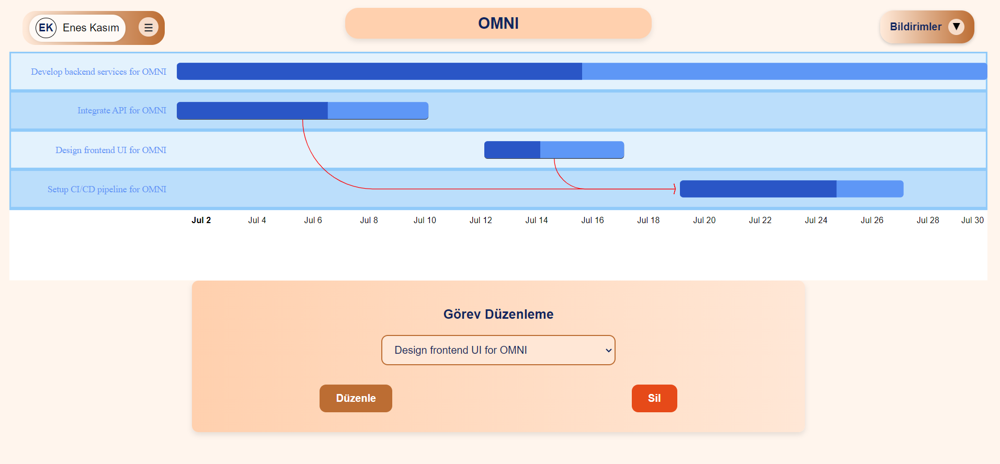

# Milestone Manager

Milestone Manager is a comprehensive application designed to efficiently manage and track milestones across various projects. Built with React and Java Spring, it offers a robust backend paired with a user-friendly frontend interface. The application provides powerful tools to monitor project progress and enhance team collaboration.

## Features

- **Task Management:** Organize your tasks by projects and milestones.
- **Interactive Calendar:** View and manage milestones using an interactive calendar interface.
- **Real-time Updates:** Changes made by team members are updated in real-time, ensuring that everyone has the latest information.
- **Reporting Tools:** Generate detailed reports on project progress and milestone achievements.
- **Java Spring Backend:** Leverages the robust Java Spring framework to handle data management and server-side logic.

## Getting Started

Follow these instructions to get a copy of the Milestone Manager running on your local machine for development and testing purposes.

### Prerequisites

Before you begin, ensure you have the following installed:
- Node.js (preferably the latest stable version)
- npm (Node Package Manager)
- Java JDK (version 11 or later recommended)
- Maven for managing the Java backend

You can check if they are installed by running:
```bash
node --version
npm --version
java -version
mvn -version
```

## Installation
Clone the repository to your local machine:

```bash
git clone https://github.com/busekeklik/MilestoneManager.git
cd MilestoneManager
```

## Frontend Installation
Navigate to the frontend directory and install the required dependencies:

```bash
cd frontend-milestone
npm install
```
Start the frontend development server:

```bash
npm start
```

## Backend Installation
Navigate to the backend directory and compile the Java Spring application using Maven:

```bash
cd backend
mvn clean install
```

Run the Spring Boot application:

```bash
mvn spring-boot:run
```

The application frontend will be available at http://localhost:3006, and the backend will run on http://localhost:3007.

### Screenshots

Here are some screenshots showcasing different features of the Milestone Manager:

- **Login Page:**
  

- **Dashboard:**
  

 - **Alerts:**
  

- **Project List:**
  

 - **Task Add:**
  

- **Gantt Chart:**
  

- **Team Management:**
  
  


